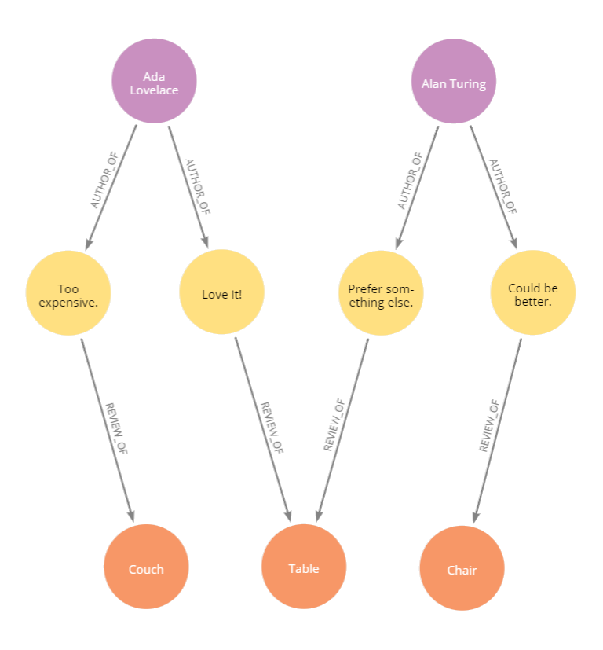

# Using Apollo Federation and Gateway With Neo4j

## Introduction and Motivation

[Apollo Gateway](https://www.apollographql.com/docs/apollo-server/federation/gateway/) composes federated schemas into a single schema, with each receiving appropriately delegated operations while running as a service. An [implementing service](https://www.apollographql.com/docs/apollo-server/federation/implementing-services/) is a schema that conforms to the [Apollo Federation specification](https://www.apollographql.com/docs/apollo-server/federation/federation-spec/), which itself is complaint with the [GraphQL specification](http://spec.graphql.org/June2018/). This approach exposes a [single data graph](https://principledgraphql.com/integrity#1-one-graph) while enabling [concern-based separation](https://www.apollographql.com/docs/apollo-server/federation/introduction/#concern-based-separation) of types _and fields_ across services, ensuring that the data graph remains simple to consume.

One way to think of Apollo Federation is that it enables microservices for GraphQL: combining multiple GraphQL services together into a single composed GraphQL gateway.

The following guide will overview this [example](https://github.com/neo4j-graphql/neo4j-graphql-js/tree/master/example/apollo-federation) found in the `neo4j-graphql.js` Github repo, based on the Apollo Federation [demo](https://github.com/apollographql/federation-demo), to demonstrate current behavior with `neo4j-graphql-js`.

## Setup

As with the Federation demo [services](https://github.com/apollographql/federation-demo/tree/master/services), we use [buildFederatedSchema](https://www.apollographql.com/docs/apollo-server/api/apollo-federation/) to build four schema:

- [Accounts](https://github.com/neo4j-graphql/neo4j-graphql-js/blob/master/example/apollo-federation/services/accounts/index.js)
- [Reviews](https://github.com/neo4j-graphql/neo4j-graphql-js/blob/master/example/apollo-federation/services/reviews/index.js)
- [Products](https://github.com/neo4j-graphql/neo4j-graphql-js/blob/master/example/apollo-federation/services/products/index.js)
- [Inventory](https://github.com/neo4j-graphql/neo4j-graphql-js/blob/master/example/apollo-federation/services/inventory/index.js)

Each federated schema is then exposed as an individual, implementing GraphQL service using [ApolloServer](https://www.apollographql.com/docs/apollo-server/). Finally, the service names and URLs of those servers are provided to [ApolloGateway](https://www.apollographql.com/docs/apollo-server/api/apollo-gateway/), starting a server for a single API based on the composition of the federated schema.

- [Gateway](https://github.com/neo4j-graphql/neo4j-graphql-js/blob/master/example/apollo-federation/gateway.js)

You can follow these steps to run the example:

- Clone or download the [neo4j-graphql-js](https://github.com/neo4j-graphql/neo4j-graphql-js) repository

Run these Npm scripts to install dependencies and start the gateway:

- `npm run install`
- `npm run start-gateway`

Upon successful startup you should see:

```shell
🚀 Accounts ready at http://localhost:4001/
🚀 Reviews ready at http://localhost:4002/
🚀 Products ready at http://localhost:4003/
🚀 Inventory ready at http://localhost:4004/
🚀 Apollo Gateway ready at http://localhost:4000/
```

The following mutation can then be run to merge example data into your Neo4j database:

```graphql
mutation {
  MergeSeedData
}
```



_Image of example data in Neo4j Bloom_
<br></br>

With your Neo4j database active and the gateway and services running, you can run current [integration tests](https://github.com/neo4j-graphql/neo4j-graphql-js/blob/master/test/integration/gateway.test.js). The below Npm script merges example data, runs tests, then deletes the data.

- `npm run test-gateway`

## Walkthrough

Let's consider a reduced version of the example schema:

```js
import { ApolloServer } from 'apollo-server';
import { buildFederatedSchema } from '@apollo/federation';
import { ApolloGateway } from '@apollo/gateway';
import { neo4jgraphql, makeAugmentedSchema, cypher } from 'neo4j-graphql-js';
import neo4j from 'neo4j-driver';

const driver = neo4j.driver(
  process.env.NEO4J_URI || 'bolt://localhost:7687',
  neo4j.auth.basic(
    process.env.NEO4J_USER || 'neo4j',
    process.env.NEO4J_PASSWORD || 'letmein'
  )
);

const augmentedAccountsSchema = makeAugmentedSchema({
  typeDefs: gql`
    type Account @key(fields: "id") {
      id: ID!
      name: String
      username: String
    }
  `,
  config: {
    isFederated: true
  }
});

const accountsService = new ApolloServer({
  schema: buildFederatedSchema([augmentedAccountsSchema]),
  context: ({ req }) => {
    return {
      driver,
      req
    };
  }
});

const reviewsService = new ApolloServer({
  schema: buildFederatedSchema([
    makeAugmentedSchema({
      typeDefs: gql`
        extend type Account @key(fields: "id") {
          id: ID! @external

          # Example: A reference to an entity defined in -this service-
          # as the type of a field added to an entity defined
          # in -another service-
          reviews(body: String): [Review]
            @relation(name: "AUTHOR_OF", direction: OUT)
        }

        type Review @key(fields: "id") {
          id: ID!
          body: String

          # Example: A reference to an entity defined in -another service-
          # as the type of a field added to an entity defined
          # in -this service-
          author: Account @relation(name: "AUTHOR_OF", direction: IN)
          product: Product @relation(name: "REVIEW_OF", direction: OUT)
        }

        extend type Product @key(fields: "upc") {
          upc: ID! @external

          # Same case as Account.reviews
          reviews(body: String): [Review]
            @relation(name: "REVIEW_OF", direction: IN)
        }
      `,
      config: {
        isFederated: true
      }
    })
  ]),
  context: ({ req }) => {
    return {
      driver,
      req
    };
  }
});

const productService = new ApolloServer({
  schema: buildFederatedSchema([
    makeAugmentedSchema({
      typeDefs: gql`
        type Product @key(fields: "upc") {
          upc: String!
          name: String
          price: Int
          weight: Int
        }
      `,
      config: {
        isFederated: true
      }
    })
  ]),
  context: ({ req }) => {
    return {
      driver,
      req
    };
  }
});

const inventoryService = new ApolloServer({
  schema: buildFederatedSchema([
    makeAugmentedSchema({
      typeDefs: gql`
        extend type Product @key(fields: "upc") {
          upc: String! @external
          weight: Int @external
          price: Int @external
          inStock: Boolean
          shippingEstimate: Int
            @requires(fields: "weight price")
            @cypher(
              statement: """
              CALL apoc.when($price > 900,
                // free for expensive items
                'RETURN 0 AS value',
                // estimate is based on weight
                'RETURN $weight * 0.5 AS value',
                {
                  price: $price,
                  weight: $weight
                })
              YIELD value
              RETURN value.value
              """
            )
        }
      `,
      config: {
        isFederated: true
      }
    })
  ]),
  context: ({ req }) => {
    return {
      driver,
      req
    };
  }
});

// Start implementing services
accountsService.listen({ port: 4001 }).then(({ url }) => {
  console.log(`🚀 Accounts ready at ${url}`);
});

reviewsService.listen({ port: 4002 }).then(({ url }) => {
  console.log(`🚀 Reviews ready at ${url}`);
});

productsService.listen({ port: 4003 }).then(({ url }) => {
  console.log(`🚀 Products ready at ${url}`);
});

inventoryService.listen({ port: 4003 }).then(({ url }) => {
  console.log(`🚀 Products ready at ${url}`);
});

// Configure gateway
const gateway = new ApolloGateway({
  serviceList: [
    { name: 'accounts', url: 'http://localhost:4001/graphql' },
    { name: 'reviews', url: 'http://localhost:4002/graphql' },
    { name: 'products', url: 'http://localhost:4003/graphql' },
    { name: 'inventory', url: 'http://localhost:4004/graphql' }
  ]
});

// Start gateway
(async () => {
  const server = new ApolloServer({
    gateway
  });
  server.listen({ port: 4000 }).then(({ url }) => {
    console.log(`🚀 Apollo Gateway ready at ${url}`);
  });
})();
```

### Data Sources

All services in this example use `neo4j-graphql-js` and the same Neo4j database as a data source. This is only for demonstration and testing. If you have an existing monolithic GraphQL server, Gateway could compose your schema with another schema that uses `neo4j-graphql-js`, enabling [incremental adoption](https://www.apollographql.com/docs/apollo-server/federation/introduction/#incremental-adoption).

### Schema Augmentation

To support using [schema augmentation](graphql-schema-generation-augmentation.mdx) with Federation, the `isFederated` configuration option can be set to `true`. For now, this does two things.

- Ensures the return format is a schema module - an object containing `typeDefs` and `resolvers`. A schema module is the expected argument format for `buildFederatedSchema`.
  <br></br>
- The `isFederated` configuration flag is not required for supporting the use of `neo4jgraphql` to resolve a federated operation. However, two new kinds of resolvers are now generated during schema augmentation to handle entity [references](#resolving-entity-references) and [extensions](#resolving-entity-extension-fields).

## Defining An Entity

### `@key` Directive

An [entity](https://www.apollographql.com/docs/apollo-server/federation/entities) is an object type with its primary keys [defined](https://www.apollographql.com/docs/apollo-server/federation/entities/#defining) using a new [@key](https://www.apollographql.com/docs/apollo-server/federation/federation-spec/#key) type directive provided by Federation. When a service defines an object type entity, another service can [extend](http://spec.graphql.org/June2018/#ObjectTypeExtension) it, allowing that service to [reference](https://www.apollographql.com/docs/apollo-server/federation/entities/#referencing) it on fields and to [add fields](https://www.apollographql.com/docs/graphql-tools/generate-schema/#extending-types) to it that the service will be responsible for resolving.

To define an object type as an entity, its primary key fields are provided to the `fields` argument of the `@key` type directive. This allows Apollo Gateway to identify `Account` type data between services. In the below schema, the `id` field of the `Account` type is specified as a key.

###### _Accounts_

```graphql
type Account @key(fields: "id") {
  id: ID!
  name: String
  username: String
}
```

###### _Reviews_

```graphql
type Review @key(fields: "id") {
  id: ID!
  body: String
  authorID: ID
}
```

###### _Products_

```graphql
type Product @key(fields: "upc") {
  upc: String!
  name: String!
  price: Int
}
```

An entity can define [multiple keys](https://www.apollographql.com/docs/apollo-server/federation/entities/#defining-multiple-primary-keys) and its relationship fields can be used as [compound keys](https://www.apollographql.com/docs/apollo-server/federation/entities/#defining-multiple-primary-keys). When a compound key is provided in a representation, `neo4jgraphql` will generate a Cypher translation that selects only entity nodes with relationships to other nodes of the key field type that have property values matching those provided for the compound key. This translation is generated using current support for translating a [relationship field](https://github.com/neo4j-graphql/neo4j-graphql-js/blob/master/test/helpers/tck/filterTck.md#all-related-nodes-matching-filter) query [filtering](graphql-filtering.mdx) argument for the exact name of the relationship field used as a compound key.

## Referencing An Entity

A reference to an entity defined in a given service occurs when that entity is used as the type of a field added to an entity defined in another service.

With the above entities defined throughout three services, an entity is introduced from one service into another by using the GraphQL `extend` keyword. This allows for that entity to be referenced on fields of entities defined by the extending service.

For example, we can extend the `Account` type in the reviews service and reference it as the type of a new `author` field on `Review`:

###### _Reviews schema_

```graphql
extend type Account @key(fields: "id") {
  id: ID! @external
}

type Review @key(fields: "id") {
  id: ID!
  body: String
  authorID: ID
  author: Account
}
```

### `@external` Directive

Another new directive provided by Federation is the [@external](https://www.apollographql.com/docs/apollo-server/federation/federation-spec/#external) field directive. When a service extends an entity from another service, the `fields` of the `@key` directive for the entity must be marked as `@external` so field types can be known during runtime when Gateway builds a query plan.

### Resolving Entity References

When the `Review` entity is the root field type of a query, the federated operation begins with the reviews service. If [neo4jgraphql](neo4j-graphql-js-api.mdx#neo4jgraphqlobject-params-context-resolveinfo-debug-executionresult-https-graphqlorg-graphql-js-execution-execute) is used to resolve the query, it will be translated under normal conditions:

###### _Reviews query_

```graphql
query {
  Review {
    id
    body
    author {
      id
    }
  }
}
```

###### _Reviews resolver_

```js
Query: {
  async Review(object, params, context, resolveInfo) {
    return await neo4jgraphql(object, params, context, resolveInfo);
  }
}
```

This would result in querying `Account` type data in the reviews service to obtain the `id` key field for the `author` of each queried `Review`. In a federated schema, this `Account` type data for a `Review` `author` is called a **representation**. Field resolvers for fields of the entity type being represented provide representations to other services in order to fetch additional data for the entity, given its specified keys.

Here is an example of a resolver for the `author` field of the `Review` type in the reviews service, providing a representation of an `Account` entity.

```js
Review: {
  author(review, context, resolveInfo) {
    return { __typename: "Account", id: "1" };
  }
}
```

Because a query with `neo4jgraphql` resolves at the root field, all representations appropriate for the data the reviews service is responsible for are obtained and provided by the root field translation. When executing a federated query, `neo4jgraphql` decides a default `__typename`. The result is that field resolvers do not normally need to be written to provide representations.

In this example, we have not yet selected an _external_ field of the `Account` entity which is _not_ a key. We have only selected the field of an `Account` key the reviews service can provide. So there is no need to query the accounts service. If we were to select additional fields of the `Account` entity, such as `name`, which the reviews service is not responsible for resolving, it would result in the following:

###### _Query_

```graphql
query {
  Review {
    id
    body
    author {
      name
    }
  }
}
```

###### _Reviews query_

Gateway would delegate the following selections to the reviews service:

```graphql
query {
  Review {
    id
    body
    author {
      id
    }
  }
}
```

The `Account` entity representation data resolved for the `author` field would then be provided to a [new kind of resolver](https://www.apollographql.com/docs/apollo-server/federation/entities/#resolving) defined with a [\_\_resolveReference](https://www.apollographql.com/docs/apollo-server/api/apollo-federation/#__resolvereference) function in the `Account` type resolvers of the accounts service.

> An implementing service uses reference resolvers for providing data for the fields it resolves for the entities it defines. These reference resolvers are generated during schema augmentation.

###### _Accounts resolver_

```js
Account: {
  async __resolveReference(object, context, resolveInfo) {
    return await neo4jgraphql(object, {}, context, resolveInfo);
  }
}
```

###### _Accounts query_

In this case, Gateway delegates resolving the following selections to the accounts service.

```graphql
query {
  Account {
    name
  }
}
```

When deciding how to use `neo4jgraphql` to resolve the `author` field, there are a few possibilities we can consider. We may use a property on the `Review` type in a [@cypher](neo4j-graphql-js.mdx#cypher-directive) directive on its `author` field to select related `Account` data.

###### _Reviews schema_

```graphql
type Review @key(fields: "id") {
  id: ID!
  body: String
  authorID: ID
  author: Account
    @cypher(
      statement: """
      MATCH (a:Account {
        id: this.authorID
      })
      RETURN a
      """
    )
}
```

If `Review` and `Account` data are stored in Neo4j as a [property graph](https://neo4j.com/developer/graph-database/#property-graph), we can use the [@relation](neo4j-graphql-js.md#start-with-a-graphql-schema) field directive to support generated translation to [Cypher](https://neo4j.com/developer/cypher-query-language/) that selects the related `Account` through [relationships](https://neo4j.com/docs/getting-started/current/cypher-intro/patterns/#cypher-intro-patterns-relationship-syntax).

```graphql
type Review @key(fields: "id") {
  id: ID!
  body: String
  author: Account @relation(name: "AUTHOR_OF", direction: IN)
}
```

In both cases, the `id` field from each selected `Account`, related to each resolved `Review` in some way, is provided from the reviews service to the accounts service. These representations are then used by the accounts service to select `Account` entities and return a value for the `name` field of each.

The situation is similar with the `product` field on the `Review` entity in our example.

```graphql
extend type Account @key(fields: "id") {
  id: ID! @external
}

extend type Product @key(fields: "upc") {
  upc: ID! @external
}

type Review @key(fields: "id") {
  id: ID!
  body: String
  author: Account
    @cypher(
      statement: """
      MATCH (a:Account {
        id: this.authorID
      })
      RETURN a
      """
    )
  product: Product @relation(name: "REVIEW_OF", direction: OUT)
}
```

In this case, the products service would need to use a reference resolver for the `Product` entity, in order to provide its `name`, `price`, or `weight` fields when selected through the `product` field referencing it.

###### _Products resolver_

```js
Product: {
  async __resolveReference(object, context, resolveInfo) {
    return await neo4jgraphql(object, {}, context, resolveInfo);
  }
}
```

## Extending An Entity

An [extension](https://www.apollographql.com/docs/graphql-tools/generate-schema/#extending-types) of an entity defined in a given service occurs when a field is added to it by another service. This enables concern-based separation of types and fields across services. Expanding on the example schema of the reviews service, a `reviews` field is added to the type extension of the `Account` entity below.

###### _Reviews schema_

```graphql
extend type Account @key(fields: "id") {
  id: ID! @external
  name: String @external
  reviews(body: String): [Review] @relation(name: "AUTHOR_OF", direction: OUT)
}

type Review @key(fields: "id") {
  id: ID!
  body: String
  author: Account @relation(name: "AUTHOR_OF", direction: IN)
  product: Product @relation(name: "REVIEW_OF", direction: OUT)
}

extend type Product @key(fields: "upc") {
  upc: ID! @external
  reviews(body: String): [Review] @relation(name: "REVIEW_OF", direction: IN)
}
```

### Resolving Entity Extension Fields

Any other service that can reference the `Account` type can now select the `reviews` field added by the reviews service. The `Review` entity may or may not be the root field type of a query that selects the `reviews` field, so the reviews service may not receive the root operation. When it does, as with the following query, the normal type resolver for the `Review` field of the `Query` type would be called.

###### _Reviews query_

```graphql
query {
  Review {
    id
    body
    author {
      id
      name
      reviews
    }
  }
}
```

The root field type of a query that selects the `reviews` field may or may not be `Account`. The Gateway query plan may begin at the accounts service, or at some other service selecting the `reviews` field through a reference to the `Account` entity when it is used as the type of a field on another entity defined by the other service. In the below example, the accounts service initially receives the query.

###### _Accounts query_

```graphql
query {
  Account {
    id
    name
    reviews
  }
}
```

In any case, after the service that receives the root query resolves data for any selected `Account` fields it's responsible for (keys, etc.), the query plan will send any obtained `Account` representations to the reviews service for use in resolving the `reviews` field selection set its responsible for, such as `body`, from appropriately related `Review` entity data.

Resolving fields added to entities from other services also requires the new [\_\_resolveReference](https://www.apollographql.com/docs/apollo-server/api/apollo-federation/#__resolvereference) type resolver. In the case of the `reviews` field added to the `Account` extension, the reviews service must provide a reference resolver for the `Account` entity in order to support resolving `Review` entity data selected through the `reviews` field.

> An implementing service uses reference resolvers for providing data for the fields it resolves for its extensions of entities defined by other services. These reference resolvers are generated during schema augmentation.

###### _Accounts resolver_

```js
Account: {
  async __resolveReference(object, context, resolveInfo) {
    const entityData = await neo4jgraphql(object, {}, context, resolveInfo);
    return {
      // Entity data possibly previously resolved from other services
      ...object,
      // Entity data now resolved for any selected fields this service is responsible for
      ...entityData
    };
  }
}
```

### `@requires` Directive

Federation also provides a [@requires](https://www.apollographql.com/docs/apollo-server/federation/entities/#extending-an-entity-with-computed-fields-advanced) field directive that a service can use to define `@external` fields of an extended entity from another service as necessary for resolving the _requiring_ field. This new directive also takes a `fields` argument, used to define the _required_ fields.

The resolution of a entity extension field with a `@requires` directive waits on its required fields to be resolved from the services responsible for them. If the required fields are not selected in a given query that selects the requiring field, they will still be requested from the service that resolves them and provided in representations for resolving the requiring field.

#### Resolving a `@requires` field

When using `neo4jgraphql` to resolve a `@requires` field, generated translation uses any values resolved for its `fields` as additional selection keys for the entity defining the field.

Let's take a look at the inventory service from the Federation demo. The `Product` entity defined by the products service is extended to provide additional fields when it is queried.

##### _Inventory schema (demo)_

```graphql
extend type Product @key(fields: "upc") {
  upc: String! @external
  weight: Int @external
  price: Int @external
  inStock: Boolean
  shippingEstimate: Int @requires(fields: "weight price")
}
```

In the demo, the execution of a [shippingEstimate](https://github.com/apollographql/federation-demo/blob/1a73e0f6f34b57ac4a555568034e83abe461d16e/services/inventory/index.js#L22) field resolver for the `Product` entity in the inventory service waits on the products service to resolve the required `@external` fields, `weight` and `price`, to be provided as a representation used in conditional logic.

##### _Inventory resolver (demo)_

```js
Product: {
  shippingEstimate(object) {
    // free for expensive items
    if (object.price > 1000) return 0;
    // estimate is based on weight
    return object.weight * 0.5;
  }
}
```

### When `@cypher` `@requires`

In this case, our example uses a `@cypher` directive in combination with a `@requires` directive in order to support translating it with custom Cypher after the required `Product` data has been resolved. Instead of using a field resolver, the above conditional logic can be expressed in Cypher using a `CALL` to the [apoc.when](https://markhneedham.com/blog/2019/07/31/neo4j-conditional-where-query-apoc/) Neo4j database [procedure](https://neo4j.com/docs/java-reference/current/extending-neo4j/procedures-and-functions/procedures/) from [APOC](https://neo4j.com/labs/apoc/) - a database plugin already used in supporting some other aspects of translation in `neo4j-graphql-js`.

Now we can finally take a look at our example inventory schema.

##### _Inventory schema_

```graphql
extend type Product @key(fields: "upc") {
  upc: String! @external
  weight: Int @external
  price: Int @external
  inStock: Boolean
  shippingEstimate: Int
    @requires(fields: "weight price")
    @cypher(
      statement: """
      CALL apoc.when($price > 900,
        // free for expensive items
        'RETURN 0 AS value',
        // estimate is based on weight
        'RETURN $weight * 0.5 AS value',
        {
          price: $price,
          weight: $weight
        })
      YIELD value
      RETURN value.value
      """
    )
}
```

### `@provides` Directive

As an optional optimization, the Federation [@provides](https://www.apollographql.com/docs/apollo-server/federation/entities/#resolving-another-services-field-advanced) directive can be used when both a service defining an entity and another service extending it can access the same data source to resolve its fields. This directive also takes a `fields` argument, used by a given service to define which fields of an extended entity it's responsible for resolving, given those fields could be resolved by either service.

## Resources

Here are some additional resources to learn more about Apollo Federation and using GraphQL with Neo4j.

### Videos

- [Introducing Apollo Federation](https://www.youtube.com/watch?v=WIeoBYRbprQ)
  As part of [Apollo Day Seattle 2019](https://www.youtube.com/playlist?list=PLpi1lPB6opQznIY72BAmWtGm50D-WkYxv), this video overviews why Apollo developed Federation & Gateway as the evolution of [schema stitching](https://www.apollographql.com/docs/apollo-server/features/schema-stitching/) and demonstrates features by explaining the schema for the `accounts`, `products`, and `reviews` services of the [Federation demo](https://github.com/apollographql/federation-demo).
  <br></br>
- [Your First Federated Schema with Apollo Server](https://youtu.be/v_1bn2sHdk4)
  As part of the [Apollo Space Camp](https://www.eventbrite.com/e/apollo-space-camp-tickets-101566159116#) online event, part two of this video demonstrates using Gateway with services for `astronauts` and `missions`, and a [repository](https://github.com/mandiwise/space-camp-federation-demo) you can clone to try it out.

### Articles

- [Apollo Federation Introduction](https://www.apollographql.com/blog/apollo-federation-f260cf525d21) - An [Apollo Blog](https://www.apollographql.com/blog/) article introducing Federation by explaining the services used in the Federation demo.
  <br></br>
- [Schema stitching guide](https://www.apollographql.com/docs/apollo-server/federation/migrating-from-stitching/) - Apollo provides a guide for migrating from schema stitching to using federated schemas.

### Libraries

- [@apollo/federation](https://www.npmjs.com/package/@apollo/federation) - This package provides utilities for creating GraphQL microservices, which can be combined into a single endpoint through tools like Apollo Gateway.
  <br></br>
- [@apollo/gateway](https://www.npmjs.com/package/@apollo/gateway) - A GraphQL to Cypher query execution layer for Neo4j and JavaScript GraphQL implementations.
  <br></br>
- [neo4j-graphql-js](https://www.npmjs.com/package/neo4j-graphql-js) - A GraphQL to Cypher query execution layer for Neo4j and JavaScript GraphQL implementations.
  <br></br>
- [neo4j-driver](https://www.npmjs.com/package/neo4j-driver) - A database driver for Neo4j 3.0.0+.
  <br></br>
- [Awesome Procedures On Cypher (APOC)](https://neo4j.com/labs/apoc/) - APOC is an add-on library for Neo4j that provides hundreds of procedures and functions adding a lot of useful functionality.
