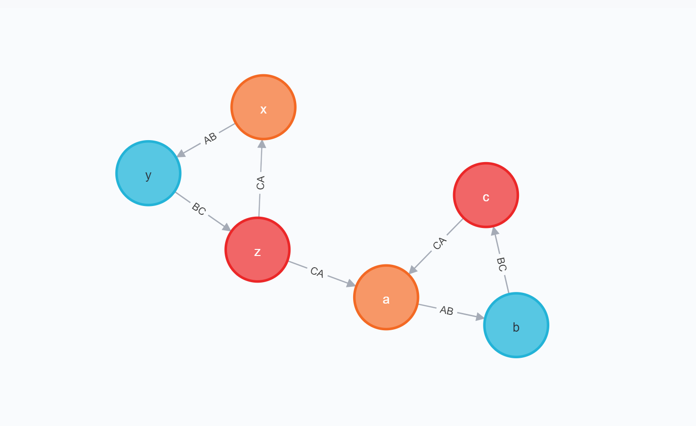

# Adding Custom Logic To Our GraphQL API

Adding custom logic to our GraphQL API is necessary any time our application requires logic beyond simple CRUD operations (which are auto-generated by `makeAugmentedSchema`).

There are two options for adding custom logic to your API using neo4j-graphql.js:

1. Using the `@cypher` GraphQL schema directive to express your custom logic using Cypher, or
2. By implementing custom resolvers and attaching them to the GraphQL schema

## The `@cypher` GraphQL Schema Directive

We expose Cypher through GraphQL via the `@cypher` directive. Annotate a field in your schema with the `@cypher` directive to map the results of that query to the annotated GraphQL field. The `@cypher` directive takes a single argument `statement` which is a Cypher statement. Parameters are passed into this query at runtime, including `this` which is the currently resolved node as well as any field-level arguments defined in the GraphQL type definition.

> The `@cypher` directive feature used in the Query API requires the use of the APOC standard library plugin. Be sure you've followed the steps to install APOC in the Project Setup section of this chapter.

### Computed Scalar Fields

We can use the `@cypher` directive to define a custom scalar field, defining a computed field in our schema. Here we add an `averageStars` field to the `Business` type which calculates the average stars of all reviews for the business using the `this` variable.

```graphql
type Business {
  businessId: ID!
  averageStars: Float!
    @cypher(
      statement: "MATCH (this)<-[:REVIEWS]-(r:Review) RETURN avg(r.stars)"
    )
  name: String!
  city: String!
  state: String!
  address: String!
  location: Point!
  reviews: [Review] @relation(name: "REVIEWS", direction: IN)
  categories: [Category] @relation(name: "IN_CATEGORY", direction: OUT)
}
```

Now we can include the `averageStars` field in our GraphQL query:

```graphql
{
  Business {
    name
    averageStars
  }
}
```

And we see in the results that the computed value for `averageStars` is now included.

```json
{
  "data": {
    "Business": [
      {
        "name": "Hanabi",
        "averageStars": 5
      },
      {
        "name": "Zootown Brew",
        "averageStars": 5
      },
      {
        "name": "Ninja Mike's",
        "averageStars": 4.5
      }
    ]
  }
}
```

The generated Cypher query includes the annotated Cypher query as a sub-query, preserving the single database call to resolve the GraphQL request.

### Computed Object And Array Fields

We can also use the `@cypher` schema directive to resolve object and array fields. Let's add a recommended business field to the `Business` type. We'll use a simple Cypher query to find common businesses that other users reviewed. For example, if a user likes "Market on Front", we could recommend other businesses that users who reviewed "Market on Front" also reviewed.

```cypher
MATCH (b:Business {name: "Market on Front"})<-[:REVIEWS]-(:Review)<-[:WROTE]-(:User)-[:WROTE]->(:Review)-[:REVIEWS]->(rec:Business)
WITH rec, COUNT(*) AS score
RETURN rec ORDER BY score DESC
```

We can make use of this Cypher query in our GraphQL schema by including it in a `@cypher` directive on the `recommended` field in our `Business` type definition.

```graphql
type Business {
  businessId: ID!
  averageStars: Float!
    @cypher(
      statement: "MATCH (this)<-[:REVIEWS]-(r:Review) RETURN avg(r.stars)"
    )
  recommended(first: Int = 1): [Business]
    @cypher(
      statement: """
      MATCH (this)<-[:REVIEWS]-(:Review)<-[:WROTE]-(:User)-[:WROTE]->(:Review)-[:REVIEWS]->(rec:Business)
      WITH rec, COUNT(*) AS score
      RETURN rec ORDER BY score DESC LIMIT $first
      """
    )
  name: String!
  city: String!
  state: String!
  address: String!
  location: Point!
  reviews: [Review] @relation(name: "REVIEWS", direction: IN)
  categories: [Category] @relation(name: "IN_CATEGORY", direction: OUT)
}
```

We also define a `first` field argument, which is passed to the Cypher query included in the `@cypher` directive and acts as a limit on the number of recommended businesses returned.

### Custom Top-Level Query Fields

Another helpful way to use the `@cypher` directive is as a custom query or mutation field. For example, let's see how we can add full-text query support to search for businesses. Applications often use full-text search to correct for things like misspellings in user input using fuzzy matching.

In Neo4j we can use full-text search by first creating a full-text index.

```cypher
CALL db.index.fulltext.createNodeIndex("businessNameIndex", ["Business"],["name"])
```

Then to query the index, in this case we misspell "coffee" but including the `~` character enables fuzzy matching, ensuring we still find what we're looking for.

```cypher
CALL db.index.fulltext.queryNodes("businessNameIndex", "cofee~")
```

Wouldn't it be nice to include this fuzzy matching full-text search in our GraphQL API? To do that let's create a Query field called `fuzzyBusinessByName` that takes a search string and searches for businesses.

```graphql
type Query {
  fuzzyBusinessByName(searchString: String): [Business]
    @cypher(
      statement: """
      CALL db.index.fulltext.queryNodes( 'businessNameIndex', $searchString+'~')
      YIELD node RETURN node;
      """
    )
}
```

We can now search for business names using this fuzzy matching.

```graphql
{
  fuzzyBusinessByName(searchString: "libary") {
    name
  }
}
```

Since we are using full-text search, even though we spell "library" incorrectly, we still find matching results.

```json
{
  "data": {
    "fuzzyBusinessByName": [
      {
        "name": "Missoula Public Library"
      }
    ]
  }
}
```

The `@cypher` schema directive is a powerful way to add custom logic and advanced functionality to our GraphQL API. We can also use the `@cypher` directive for authorization features, accessing values such as authorization tokens from the request object, a pattern that is discussed in [the GraphQL authorization page.](neo4j-graphql-js-middleware-authorization.mdx#cypher-parameters-from-context)

## Custom Nested Mutations

Nested mutations can be used by adding input object type arguments when overwriting generated node mutations or when using a custom mutation with a `@cypher` directive on a `Mutation` type field. The `@cypher` directive can be used on the fields of nested input object arguments to provide Cypher statements to execute after generated translation.

> This feature requires a Neo4j database version that supports Cypher 4.1 [correlated subqueries](https://neo4j.com/docs/cypher-manual/current/clauses/call-subquery/).

Consider the below example schema:

- The `MergeA` mutation generated by `makeAugmentedSchema` for the `A` node type is overwritten.
- The `CustomMergeA` defines a `@cypher` mutation that provides custom logic for merging a single `A` type node.
- The `BatchMergeA` defines a `@cypher` mutation that provides custom logic for merging many `A` type nodes.

```graphql
type Mutation {
  MergeA(id: ID!, b: [ABMutation!]): A!
  CustomMergeA(data: AInput!): A!
    @cypher(
      statement: """
      MERGE (a: A {
        id: $data.id
      })
      RETURN a
      """
    )
  BatchMergeA(data: [AInput!]!): [A!]!
    @cypher(
      statement: """
      UNWIND $data AS AInput
      MERGE (a: A {
        id: AInput.id
      })
      RETURN a
      """
    )
}

type A {
  id: ID! @id
  b: [B] @relation(name: "AB", direction: OUT)
}

input AInput {
  id: ID!
  b: ABMutation
}

input ABMutation {
  merge: [BInput]
    @cypher(
      statement: """
      WITH a
      MERGE (b: B {
        id: BInput.id
      })
      MERGE (a)-[:AB]->(b)
      WITH b
      """
    )
}

type B {
  id: ID! @id
  c: [C] @relation(name: "BC", direction: OUT)
}

input BInput {
  id: ID!
  c: BCMutation
}

input BCMutation {
  merge: [CInput]
    @cypher(
      statement: """
      MERGE (c: C {
        id: CInput.id
      })
      MERGE (b)-[:BC]->(c)
      """
    )
}

type C {
  id: ID! @id
  a: [A] @relation(name: "CA", direction: OUT)
}

input CInput {
  id: ID!
  a: CAMutation
}

input CAMutation {
  merge: [AInput]
    @cypher(
      statement: """
      MERGE (a: A {
        id: AInput.id
      })
      MERGE (c)-[:CA]->(a)
      """
    )
}
```

### Generated Mutations

The [generated api](https://grandstack.io/docs/graphql-schema-generation-augmentation#generated-mutations) for `Create`, `Merge`, `Update`, and `Delete` node mutation fields can be overwritten to customize their arguments. If a `@cypher` directive is not used when authoring the mutation field yourself, then a generated translation is still used. When argument values are provided for nested `@cypher` input fields, their Cypher statements are executed after the generated translation. This also works when authoring your own `data` arguments in the format of the [experimental](https://grandstack.io/docs/graphql-schema-generation-augmentation#experimental-api) node mutation API.

The `MergeA` mutation field first has an argument for the expected primary key in order to match the generated format. A list argument named `b` is then added to make it possible to provide an argument value for the nested `@cypher` field named `merge` on the `ABMutation` input object.

This pattern continues with further nested input objects in the below example mutation:

```graphql
MergeA(id: ID!, b: [ABMutation!]): A!
```

```graphql
mutation {
  MergeA(
    id: "a"
    b: [
      {
        merge: { id: "b", c: { merge: { id: "c", a: { merge: { id: "a" } } } } }
      }
    ]
  ) {
    id
    b {
      id
      c {
        id
        a {
          id
        }
      }
    }
  }
}
```

#### Importing Variables

Explicitly declaring which [Cypher variables](https://neo4j.com/docs/cypher-manual/current/syntax/variables/index.html) to continue with helps prevent naming conflicts when moving from one nested `@cypher` statement to the next. Variables can be imported into or exported out of nested `@cypher` statements using the Cypher [WITH](https://neo4j.com/docs/cypher-manual/current/clauses/with/) clause.

When using a `WITH` clause to import variables into a nested `@cypher` statement, any variables not declared can be reused. If no clause is provided, all variables in scope are imported by default.

In the statement for the `merge` field on the `ABMutation` input object, the `a` variable is explicitly imported. This excludes `b` from its variable scope to prevent a naming conflict between the existing `b` argument on the `MergeA` mutation and naming a new variable `b` when merging `B` type nodes.

Without the `WITH a` clause, the mutation would fail with the Cypher error: `"Variable b already declared"`.

```graphql
input ABMutation {
  merge: [BInput]
    @cypher(
      statement: """
      WITH a
      MERGE (b: B {
        id: BInput.id
      })
      MERGE (a)-[:AB]->(b)
      WITH b
      """
    )
}
```

#### Data Variables

Input object fields using the `@cypher` directive are supported by generated [UNWIND](https://neo4j.com/docs/cypher-manual/current/clauses/unwind/) clauses within nested subqueries. Because of this, a Cypher variable matching the name of the input object is always available. In the above Cypher statement for the `merge` field on the `ABMutation` input object, a generated `UNWIND` clause declares the `BInput` variable for accessing parameter data provided to the `merge` argument.

#### Exporting Variables

When exporting variables out of a nested `@cypher` statement, any variables not exported can be reused in proceeding nested `@cypher` statements. Similar to importing variables, if no exporting `WITH` clause is provided, all variables in scope are exported.

Proceeding with the nested `@cypher` fields, the `BCMutation` input object imports and exports all variables in scope:

```graphql
input BCMutation {
  merge: [CInput]
    @cypher(
      statement: """
      MERGE (c: C {
        id: CInput.id
      })
      MERGE (b)-[:BC]->(c)
      """
    )
}
```

But in the case of the proceeding `CAMutation` input object, the mutation would fail with the Cypher error `"Variable a already declared"` without the `WITH b` clause exporting only `b`. By default, both the `a` and `b` variables would be exported, but the existing `a` node variable set by the generated translation would conflict with naming a new variable `a` when merging `A` type nodes:

```graphql
input CAMutation {
  merge: [AInput]
    @cypher(
      statement: """
      MERGE (a: A {
        id: AInput.id
      })
      MERGE (c)-[:CA]->(a)
      """
    )
}
```

With no variable naming conflicts, the successful execution of the `MergeA` mutation results in merging and relating an `A` node with a `B` node, the `B` node with a `C` node, and the `C` node with the initially merged `A` node, resulting in the below graph:


<details>
  <summary>Cypher Translation</summary>

```js
// Generated translation of MergeA
MERGE (`a`:`A`{id: $params.id})
// Continues with all variables in scope
WITH *
CALL {
  WITH *
  // Generated UNWIND clauses to progressively unwind
  // nested @cypher argument parameters
  UNWIND $params.b AS _b
  UNWIND _b.merge as BInput
  // Begin: ABMutation.merge @cypher
  // Augmented importing WITH clause to persist
  // unwound parameter, iff clause provided
  WITH BInput, a
  MERGE (b: B {
    id: BInput.id
  })
  MERGE (a)-[:AB]->(b)
  // Augmented exporting WITH clause with parameter alias
  // to allow for input type reuse
  WITH BInput AS _BInput, b
  // End: ABMutation.merge @cypher
  CALL {
    WITH *
    UNWIND _BInput.c.merge AS CInput
    MERGE (c: C {
      id: CInput.id
    })
    MERGE (b)-[:BC]->(c)
    WITH *, CInput AS _CInput
    CALL {
      WITH *
      UNWIND _CInput.a.merge AS AInput
      MERGE (a: A {
        id: AInput.id
      })
      MERGE (c)-[:CA]->(a)
      RETURN COUNT(*) AS _a_merge_
    }
    RETURN COUNT(*) AS _c_merge_
  }
  // Generated closure of variable scope for
  // RETURN clause required by subqueries
  RETURN COUNT(*) AS _b_merge_
}
// Generated translation of selection set
RETURN `a` {
  .id,
  b: [(`a`)-[:`AB`]->(`a_b`:`B`) | `a_b` {
    .id,
    c: [(`a_b`)-[:`BC`]->(`a_b_c`:`C`) | `a_b_c` {
      .id,
      a: [(`a_b_c`)-[:`CA`]->(`a_b_c_a`:`A`) | `a_b_c_a` {
        .id
      }]
    }]
  }]
} AS `a`
```

</details>

<details>
  <summary>Data</summary>

```json
{
  "data": {
    "MergeA": {
      "id": "a",
      "b": [
        {
          "id": "b",
          "c": [
            {
              "id": "c",
              "a": [
                {
                  "id": "a"
                }
              ]
            }
          ]
        }
      ]
    }
  }
}
```

</details>

### Custom Mutations

Similar to overwriting generated node mutations and adding custom arguments, nested input objects with `@cypher` fields can be used to provide additional operations to execute after the `@cypher` statement of a custom mutation:

```graphql
CustomMergeA(data: AInput!): A! @cypher(statement: """
  MERGE (a: A {
    id: $data.id
  })
  RETURN a
""")
```

```graphql
mutation {
  CustomMergeA(
    data: {
      id: "a"
      b: {
        merge: { id: "b", c: { merge: { id: "c", a: { merge: { id: "a" } } } } }
      }
    }
  ) {
    id
    b {
      id
      c {
        id
        a {
          id
        }
      }
    }
  }
}
```


#### Custom Batch Mutations

If a custom mutation uses an [UNWIND](https://neo4j.com/docs/cypher-manual/current/clauses/unwind/) clause on a list argument of input objects, then the Cypher variable must match the type name of the argument for its nested `@cypher` fields to process in the same iterative scope. List arguments of input objects are otherwise handled by generated `UNWIND` clauses, processing independently. In the below example, the `data` list argument of type `AInput` is unwound to a variable named `AInput`, following the naming convention of the variable set by generated `UNWIND` clauses:

```graphql
BatchMergeA(data: [AInput!]!): [A!]! @cypher(statement: """
  UNWIND $data AS AInput
  MERGE (a: A {
    id: AInput.id
  })
  RETURN a
""")
```

```graphql
mutation {
  BatchMergeA(
    data: [
      {
        id: "a"
        b: {
          merge: [
            {
              id: "b"
              c: { merge: [{ id: "c", a: { merge: [{ id: "a" }] } }] }
            }
          ]
        }
      }
      {
        id: "x"
        b: {
          merge: [
            {
              id: "y"
              c: {
                merge: [{ id: "z", a: { merge: [{ id: "x" }, { id: "a" }] } }]
              }
            }
          ]
        }
      }
    ]
  ) {
    id
    b {
      id
      c {
        id
        a {
          id
        }
      }
    }
  }
}
```



<details>
  <summary>Data</summary>

```json
{
  "data": {
    "BatchMergeA": [
      {
        "id": "a",
        "b": [
          {
            "id": "b",
            "c": [
              {
                "id": "c",
                "a": [
                  {
                    "id": "a"
                  }
                ]
              }
            ]
          }
        ]
      },
      {
        "id": "x",
        "b": [
          {
            "id": "y",
            "c": [
              {
                "id": "z",
                "a": [
                  {
                    "id": "a"
                  },
                  {
                    "id": "x"
                  }
                ]
              }
            ]
          }
        ]
      }
    ]
  }
}
```

</details>

## Implementing Custom Resolvers

While the `@cypher` directive is one way to add custom logic, in some cases we may need to implement custom resolvers that implement logic not able to be expressed in Cypher. For example, we may need to fetch data from another system, or apply some custom validation rules. In these cases we can implement a custom resolver and attach it to the GraphQL schema so that resolver is called to resolve our custom field instead of relying on the generated Cypher query by neo4j-graphql.js to resolve the field.

In our example let's imagine there is an external system that can be used to determine current wait times at businesses. We want to add an additional `waitTime` field to the `Business` type in our schema and implement the resolver logic for this field to use this external system.

To do this, we first add the field to our schema, adding the `@neo4j_ignore` directive to ensure the field is excluded from the generated Cypher query. This is our way of telling neo4j-graphql.js that a custom resolver will be responsible for resolving this field and we don't expect it to be fetched from the database automatically.

```graphql
type Business {
  businessId: ID!
  waitTime: Int! @neo4j_ignore
  averageStars: Float!
    @cypher(
      statement: "MATCH (this)<-[:REVIEWS]-(r:Review) RETURN avg(r.stars)"
    )
  name: String!
  city: String!
  state: String!
  address: String!
  location: Point!
  reviews: [Review] @relation(name: "REVIEWS", direction: IN)
  categories: [Category] @relation(name: "IN_CATEGORY", direction: OUT)
}
```

Next we create a resolver map with our custom resolver. We didn't have to create this previously because neo4j-graphql.js generated our resolvers for us. Our wait time calculation will be just selecting a value at random, but we could implement any custom logic here to determine the `waitTime` value, such as making a request to a 3rd party API.

```js
const resolvers = {
  Business: {
    waitTime: (obj, args, context, info) => {
      const options = [0, 5, 10, 15, 30, 45];
      return options[Math.floor(Math.random() * options.length)];
    }
  }
};
```

Then we add this resolver map to the parameters passed to `makeAugmentedSchema`.

```js
const schema = makeAugmentedSchema({
  typeDefs,
  resolvers
});
```

Now, let's search for restaurants and see what their wait times are by including the `waitTime` field in the selection set.

```graphql
{
  Business(filter: { categories_some: { name: "Restaurant" } }) {
    name
    waitTime
  }
}
```

In the results we now see a value for the wait time. Your results will of course vary since the value is randomized.

```json
{
  "data": {
    "Business": [
      {
        "name": "Ninja Mike's",
        "waitTime": 5
      },
      {
        "name": "Market on Front",
        "waitTime": 45
      },
      {
        "name": "Hanabi",
        "waitTime": 45
      }
    ]
  }
}
```

## Resources

- [Using Neo4j’s Full-Text Search With GraphQL](https://blog.grandstack.io/using-neo4js-full-text-search-with-graphql-e3fa484de2ea) Defining Custom Query Fields Using The Cypher GraphQL Schema Directive
