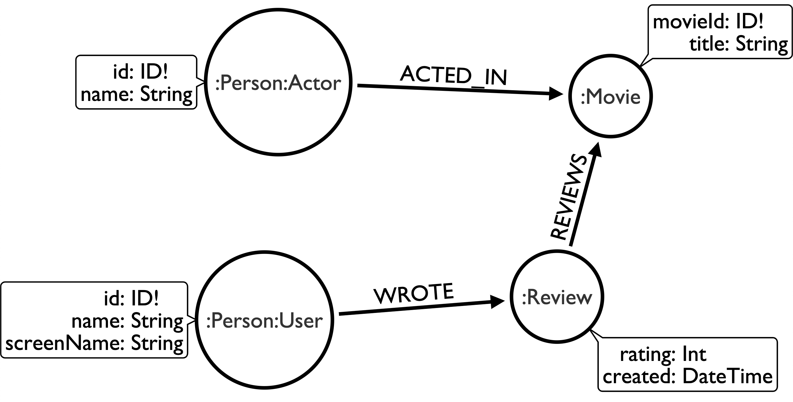
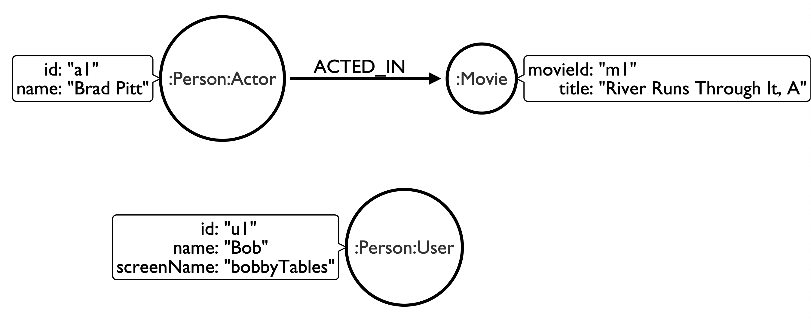
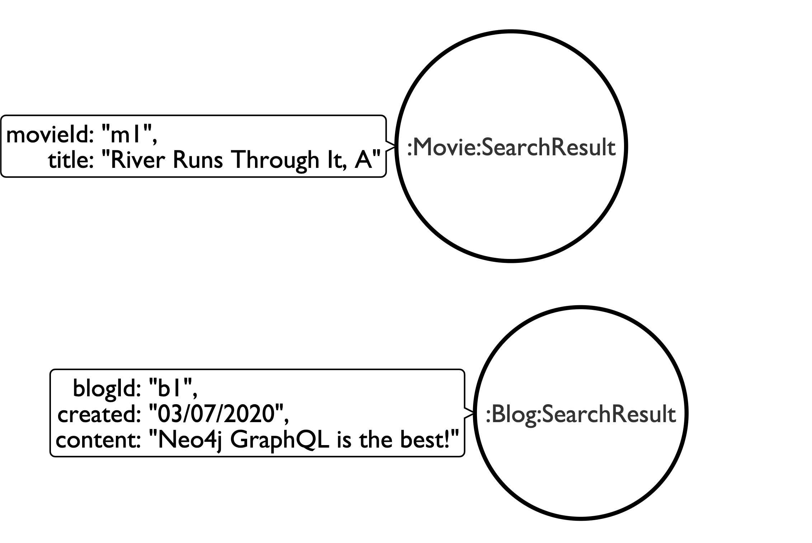

# Using GraphQL Interface And Union Types

## Overview

This page describes how interface and union types can be used with neo4j-graphql.js.

GraphQL supports two kinds of abstract types: interfaces and unions. Interfaces are abstract types that include a set of fields that all implementing types must include. A union type indicates that a field can return one of several object types, but doesn't specify any fields that must be included in the implementing types of the union. See the GraphQL documentation to learn more about [interface](https://graphql.org/learn/schema/#interfaces) and [union](https://graphql.org/learn/schema/#union-types) types.

## Interface Types

Interface types are supported in neo4j-graphql.js through the use of multiple labels in Neo4j. For example, consider the following GraphQL type definitions:

```graphql
interface Person {
  id: ID!
  name: String
}

type User implements Person {
  id: ID!
  name: String
  screenName: String
  reviews: [Review] @relation(name: "WROTE", direction: OUT)
}

type Actor implements Person {
  id: ID!
  name: String
  movies: [Movie] @relation(name: "ACTED_IN", direction: OUT)
}

type Movie {
  movieId: ID!
  title: String
}

type Review {
  rating: Int
  created: DateTime
  movie: Movie @relation(name: "REVIEWS", direction: OUT)
}
```

The above GraphQL type definitions would define the following property graph model using neo4j-graphql.js:



<!--
<ul class="graph-diagram-markup" data-internal-scale="1.41" data-external-scale="1">
  <li class="node" data-node-id="0" data-x="0" data-y="0">
    <span class="caption">:Review</span><dl class="properties"><dt>rating</dt><dd>Int</dd><dt>created</dt><dd>DateTime</dd></dl></li>
  <li class="node" data-node-id="1" data-x="-652.1715698242188" data-y="-67.44053077697754">
    <span class="caption">:Person:User</span><dl class="properties"><dt>id</dt><dd>ID!</dd><dt>name</dt><dd>String</dd><dt>screenName</dt><dd>String</dd></dl></li>
  <li class="node" data-node-id="2" data-x="-350.590405836173" data-y="-450.8161956570672">
    <span class="caption">:Person:Actor</span><dl class="properties"><dt>id</dt><dd>ID!</dd><dt>name</dt><dd>String</dd></dl></li>
  <li class="node" data-node-id="3" data-x="203.93539428710938" data-y="-329.8392028808594">
    <span class="caption">:Movie</span><dl class="properties"><dt>movieId</dt><dd>ID!</dd><dt>title</dt><dd>String</dd></dl></li>
  <li class="relationship" data-from="1" data-to="0">
    <span class="type">WROTE</span>
  </li>
  <li class="relationship" data-from="0" data-to="3">
    <span class="type">REVIEWS</span>
  </li>
  <li class="relationship" data-from="2" data-to="3">
    <span class="type">ACTED_IN</span>
  </li>
</ul>
-->

Note that the label `Person` (which represents the interface type) is added to each node of a type implementing the `Person` interface (`User` and `Actor`),

### Interface Mutations

When an interface type is included in the GraphQL type definitions, the generated create mutations will add the additional label for the interface type to any nodes of an implementing type when creating data. For example consider the following mutations.

```graphql
mutation {
  u1: CreateUser(name: "Bob", screenName: "bobbyTables", id: "u1") {
    id
  }
  a1: CreateActor(name: "Brad Pitt", id: "a1") {
    id
  }
  m1: CreateMovie(title: "River Runs Through It, A", movieId: "m1") {
    movieId
  }
  am1: AddActorMovies(from: { id: "a1" }, to: { movieId: "m1" }) {
    from {
      id
    }
  }
}
```

This creates the following graph in Neo4j (note the use of multiple labels):



<!--
<ul class="graph-diagram-markup" data-internal-scale="1.41" data-external-scale="1">
  <li class="node" data-node-id="1" data-x="-58.7245244235856" data-y="-3.9691390433209954">
    <span class="caption">:Person:User</span><dl class="properties"><dt>id</dt><dd>"u1"</dd><dt>name</dt><dd>"Bob"</dd><dt>screenName</dt><dd>"bobbyTables"</dd></dl></li>
  <li class="node" data-node-id="2" data-x="-396.65084622430464" data-y="-318.41422244673925">
    <span class="caption">:Person:Actor</span><dl class="properties"><dt>id</dt><dd>"a1"</dd><dt>name</dt><dd>"Brad Pitt"</dd></dl></li>
  <li class="node" data-node-id="3" data-x="85.11565837454289" data-y="-318.41422244673925">
    <span class="caption">:Movie</span><dl class="properties"><dt>movieId</dt><dd>"m1"</dd><dt>title</dt><dd>"River Runs Through It, A"</dd></dl></li>
  <li class="relationship" data-from="2" data-to="3">
    <span class="type">ACTED_IN</span>
  </li>
</ul>
-->

### Interface Queries

#### Query field

A query field is added to the generated `Query` type for each interface. For example, querying using our `Person` interface.

```graphql
query {
  Person {
    name
  }
}
```

```json
{
  "data": {
    "Person": [
      {
        "name": "Bob"
      },
      {
        "name": "Brad Pitt"
      }
    ]
  }
}
```

#### \_\_typename introspection field

The `__typename` introspection field can be added to the selection set to determine the concrete type of the object.

```graphql
query {
  Person {
    name
    __typename
  }
}
```

```json
{
  "data": {
    "Person": [
      {
        "name": "Bob",
        "__typename": "User"
      },
      {
        "name": "Brad Pitt",
        "__typename": "Actor"
      }
    ]
  }
}
```

#### Inline fragments

[Inline fragments](https://graphql.org/learn/queries/#inline-fragments) can be used to access fields of the concrete types in the selection set.

```graphql
query {
  Person {
    name
    __typename
    ... on Actor {
      movies {
        title
      }
    }

    ... on User {
      screenName
    }
  }
}
```

```json
{
  "data": {
    "Person": [
      {
        "name": "Bob",
        "__typename": "User",
        "screenName": "bobbyTables"
      },
      {
        "name": "Brad Pitt",
        "__typename": "Actor",
        "movies": [
          {
            "title": "River Runs Through It, A"
          }
        ]
      }
    ]
  }
}
```

#### Filtering With Interfaces

The generated filter arguments can be used for interface types. Note however that only fields in the interface definition are included in the generated filter arguments as those apply to all concrete types.

```graphql
query {
  Person(filter: { name_contains: "Brad" }) {
    name
    __typename
    ... on Actor {
      movies {
        title
      }
    }

    ... on User {
      screenName
    }
  }
}
```

```json
{
  "data": {
    "Person": [
      {
        "name": "Brad Pitt",
        "__typename": "Actor",
        "movies": [
          {
            "title": "River Runs Through It, A"
          }
        ]
      }
    ]
  }
}
```

#### Interface Relationship Fields

We can also use interfaces when defining relationship fields. For example:

```graphql
  friends: [Person] @relation(name: "FRIEND_OF", direction: OUT)

```

## Union Types

> Note that using union types for relationship types is not yet supported by neo4j-graphql.js. Unions can however be used on relationship fields.

Union types are abstract types that do not specify any fields that must be included in the implementing types of the union, therefore it cannot be assumed that the concrete types of a union include any overlapping fields. Similar to interface types, in neo4j-graphql.js an additional label is added to nodes to represent the union type.

For example, consider the following GraphQL type definitions:

```graphql
union SearchResult = Blog | Movie

type Blog {
  blogId: ID!
  created: DateTime
  content: String
}

type Movie {
  movieId: ID!
  title: String
}
```

### Union Mutations

Using the generated mutations to create the following data:

```graphql
mutation {
  b1: CreateBlog(
    blogId: "b1"
    created: { year: 2020, month: 3, day: 7 }
    content: "Neo4j GraphQL is the best!"
  ) {
    blogId
  }
  m1: CreateMovie(movieId: "m1", title: "River Runs Through It, A") {
    movieId
  }
}
```

The above mutations create the following data in Neo4j. Note the use of multiple node labels.



<!--
<ul class="graph-diagram-markup" data-internal-scale="1.41" data-external-scale="1">
  <li class="node" data-node-id="4" data-x="-406.1722451067986" data-y="-5.943980115525266">
    <span class="caption">:Blog:SearchResult</span><dl class="properties"><dt>blogId</dt><dd>"b1",</dd><dt>created</dt><dd>"03/07/2020",</dd><dt>content</dt><dd>"Neo4j GraphQL is the best!"</dd></dl></li>
  <li class="node" data-node-id="5" data-x="-502.1348019863696" data-y="-374.4178284990027">
    <span class="caption">:Movie:SearchResult</span><dl class="properties"><dt>movieId</dt><dd>"m1",</dd><dt>title</dt><dd>"River Runs Through It, A"</dd></dl></li>
</ul>
-->

### Union Queries

#### Query Field

A query field is added to the Query type for each union type defined in the schema.

```graphql
{
  SearchResult {
    __typename
  }
}
```

```json
{
  "data": {
    "SearchResult": [
      {
        "__typename": "Blog"
      },
      {
        "__typename": "Movie"
      }
    ]
  }
}
```

#### Inline Fragments

Inline fragments are used in the selection set to access fields of the concrete type.

```graphql
{
  SearchResult {
    __typename
    ... on Blog {
      created {
        formatted
      }
      content
    }

    ... on Movie {
      title
    }
  }
}
```

```json
{
  "data": {
    "SearchResult": [
      {
        "__typename": "Blog",
        "created": {
          "formatted": "2020-03-07T00:00:00Z"
        },
        "content": "Neo4j GraphQL is the bedst!"
      },
      {
        "__typename": "Movie",
        "title": "River Runs Through It, A"
      }
    ]
  }
}
```

#### Using With @cypher Directive Query Fields

We can also use unions with `@cypher` directive fields. Unions are often useful in the context of search results, where the result object might be one of several types. In order to support this usecase full text indexes can be used to search across multiple node labels and properties.

First, let's create a full text index in Neo4j. This index will include the `:Blog(content)` and `:Movie(title)` properties.

```cypher
CALL db.index.fulltext.createNodeIndex("searchIndex", ["Blog","Movie"],["content", "title"])
```

Now we can add a `search` field to the Query type that searches the full text index.

```graphql
type Query {
  search(searchString: String!): [SearchResult] @cypher(statement:"CALL db.index.fulltext.queryNodes("searchIndex", $searchString) YIELD node RETURN node")
}
```

Now we can query the `search` field, leveraging the full text index.

```graphql
{
  search(searchString: "river") {
    __typename
    ... on Movie {
      title
    }
    ... on Blog {
      created {
        formatted
      }
      content
    }
  }
}
```

```json
{
  "data": {
    "search": [
      {
        "__typename": "Movie",
        "title": "River Runs Through It, A"
      }
    ]
  }
}
```

## Resources

- [Using Neo4j’s Full-Text Search With GraphQL](https://blog.grandstack.io/using-neo4js-full-text-search-with-graphql-e3fa484de2ea) -- Defining Custom Query Fields Using The Cypher GraphQL Schema Directive
