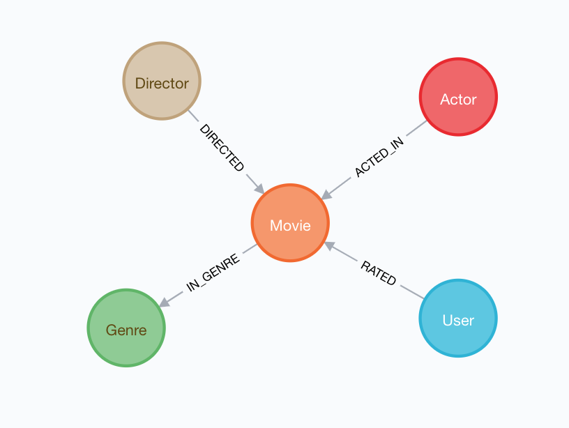

# Inferring GraphQL Schema From An Existing Database

Typically when we start a new application, we don't have an existing database and follow the GraphQL-First development paradigm by starting with type definitions. However, in some cases we may have an existing Neo4j database populated with data. In those cases, it can be convenient to generate GraphQL type definitions based on the existing database that can then be fed into `makeAugmentedSchema` to generate a GraphQL API for the existing database. We can do this with the use of the `inferSchema` functionality in neo4j-graphql.js.

Let's use the [Neo4j Sandbox movies recommendation dataset](https://neo4j.com/sandbox?usecase=recommendations) to auto-generate GraphQL type definitions using `inferSchema`.

This dataset has information about movies, actors, directors, and user ratings of movies, modeled as a graph:



## How To Use `inferSchema`

The `inferSchema` function takes a Neo4j JavaScript driver instance and returns a Promise that evaluates to our GraphQL type definitions, defined using GraphQL Schema Definition Language (SDL). Here’s a simple example that will inspect our local Neo4j database and log the GraphQL type definitions to the console.

```js
const { inferSchema } = require('neo4j-graphql-js');
const neo4j = require('neo4j-driver');

const driver = neo4j.driver(
  'bolt://localhost:7687',
  neo4j.auth.basic('neo4j', 'letmein')
);
inferSchema(driver).then(result => {
  console.log(result.typeDefs);
});
```

Running this on [the movies dataset](https://neo4j.com/sandbox?usecase=recommendations) would produce the following GraphQL type definitions:

```graphql
type Movie {
  _id: Long!
  countries: [String]
  imdbId: String!
  imdbRating: Float
  imdbVotes: Int
  languages: [String]
  movieId: String!
  plot: String
  poster: String
  released: String
  runtime: Int
  title: String!
  tmdbId: String
  year: Int
  in_genre: [Genre] @relation(name: "IN_GENRE", direction: OUT)
  users: [User] @relation(name: "RATED", direction: IN)
  actors: [Actor] @relation(name: "ACTED_IN", direction: IN)
  directors: [Director] @relation(name: "DIRECTED", direction: IN)
}

type RATED @relation(name: "RATED") {
  from: User!
  to: Movie!
  created: DateTime!
  rating: Float!
  timestamp: Int!
}

type User {
  _id: Long!
  name: String!
  userId: String!
  rated: [Movie] @relation(name: "RATED", direction: OUT)
  RATED_rel: [RATED]
}

type Actor {
  _id: Long!
  name: String!
  acted_in: [Movie] @relation(name: "ACTED_IN", direction: OUT)
}

type Director {
  _id: Long!
  name: String!
  directed: [Movie] @relation(name: "DIRECTED", direction: OUT)
}

type Genre {
  _id: Long!
  name: String!
  movies: [Movie] @relation(name: "IN_GENRE", direction: IN)
}
```

## Using `inferSchema` With `makeAugmentedSchema`

The real power of `inferSchema` comes when used in combination with `makeAugmentedSchema` to create a GraphQL API from only the database. Since `makeAugmentedSchema` handles generating our Query/Mutation fields and resolvers, that means creating a GraphQL API on top of Neo4j is as simple as passing our typedefs from `inferSchema` into `makeAugmentedSchema`.

Here’s a full example:

```js
const { makeAugmentedSchema, inferSchema } = require('neo4j-graphql-js');
const { ApolloServer } = require('apollo-server');
const neo4j = require('neo4j-driver');

// Create Neo4j driver instance
const driver = neo4j.driver(
  process.env.NEO4J_URI || 'bolt://localhost:7687',
  neo4j.auth.basic(
    process.env.NEO4J_USER || 'neo4j',
    process.env.NEO4J_PASSWORD || 'letmein'
  )
);

// Connect to existing Neo4j instance, infer GraphQL typedefs
// generate CRUD GraphQL API using makeAugmentedSchema
const inferAugmentedSchema = driver => {
  return inferSchema(driver).then(result => {
    return makeAugmentedSchema({
      typeDefs: result.typeDefs
    });
  });
};

// Spin up GraphQL server using auto-generated GraphQL schema object
const createServer = schema =>
  new ApolloServer({
    schema
    context: { driver }
    }
  });

inferAugmentedSchema(driver)
  .then(createServer)
  .then(server => server.listen(3000, '0.0.0.0'))
  .then(({ url }) => {
    console.log(`GraphQL API ready at ${url}`);
  })
  .catch(err => console.error(err));
```

## Persisting The Inferred Schema

Often it is helpful to generate the inferred schema as a starting point, persist it to a file, and then adjust the generated type definitions as necessary (such as adding custom logic with the use of `@cypher` directives). Here we generate GraphQL type definitions for our database, saving them to a file named schema.graphql:

```js
const neo4j = require('neo4j-driver');
const { inferSchema } = require('neo4j-graphql-js');
const fs = require('fs');

const driver = neo4j.driver(
  'bolt://localhost:7687',
  neo4j.auth.basic('neo4j', 'letmein')
);

const schemaInferenceOptions = {
  alwaysIncludeRelationships: false
};

inferSchema(driver, schemaInferenceOptions).then(result => {
  fs.writeFile('schema.graphql', result.typeDefs, err => {
    if (err) throw err;
    console.log('Updated schema.graphql');
    process.exit(0);
  });
});
```

Then we can load this schema.graphql file and pass the type definitions into `makeAugmentedSchema`.

```js
// Load GraphQL type definitions from schema.graphql file
const typeDefs = fs
  .readFileSync(path.join(__dirname, 'schema.graphql'))
  .toString('utf-8');
```

## Resources

- [Inferring GraphQL Type Definitions From An Existing Neo4j Database](https://blog.grandstack.io/inferring-graphql-type-definitions-from-an-existing-neo4j-database-dadca2138b25) - Create a GraphQL API Without Writing Resolvers Or TypeDefs
- [Schema auto-generation example in neo4j-graphql-js Github repository](https://github.com/neo4j-graphql/neo4j-graphql-js/blob/master/example/autogenerated/autogen.js) - example code showing how to use `inferSchema` and `makeAugmentedSchema` together.
